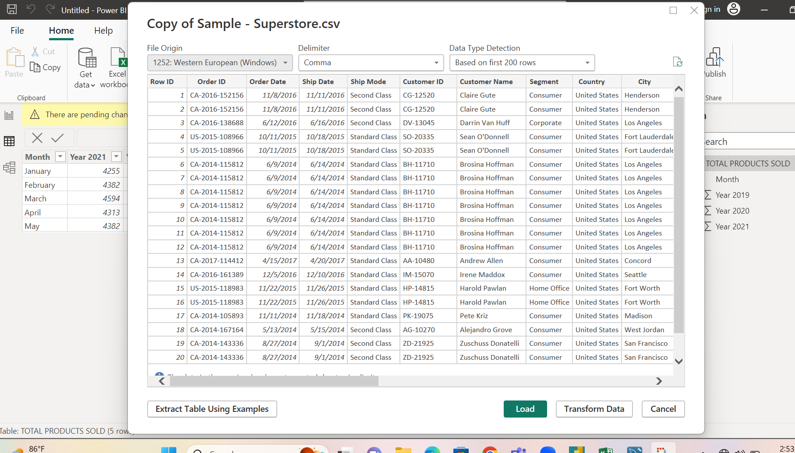
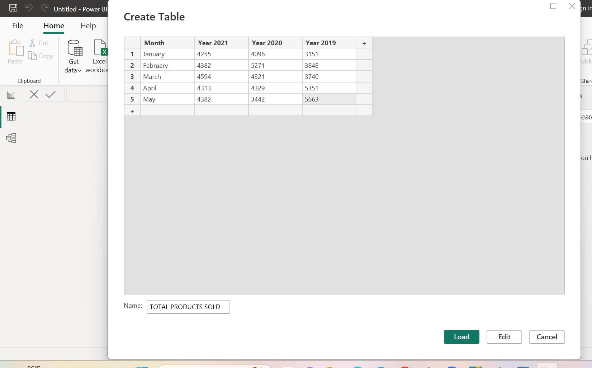
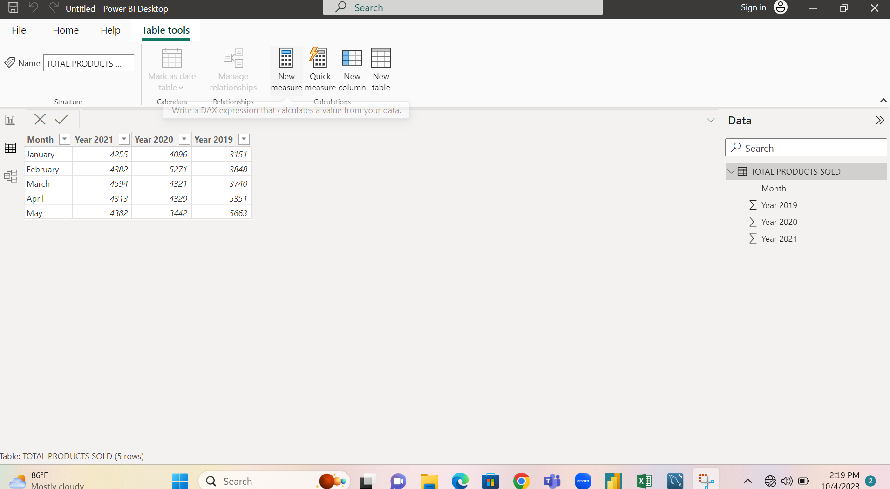

# TASK1POWERBI
## INTRODUCTION
### POWERBI is a business intelligence tool that provides insight into organizational datasets.
### With the help of POWERBI , users can create interactive reports, dashboards, and visualizations

## PROBLEM STATEMENT
## Import the superstore dataset from file
GO TO GET DATA ICON. Follow the drop-down menu and click TEXT/CSV

## Create a table

## 

